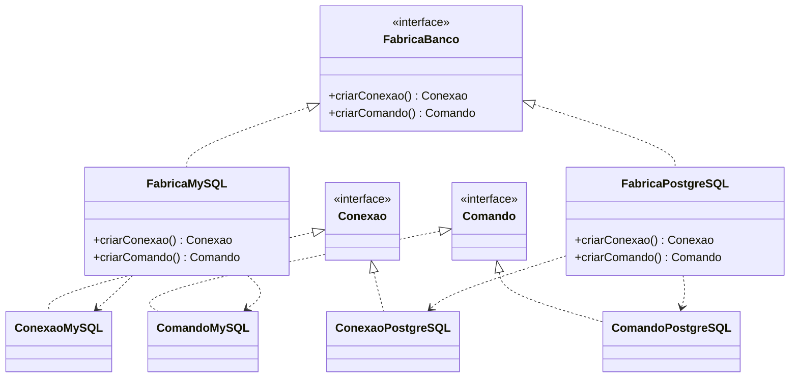
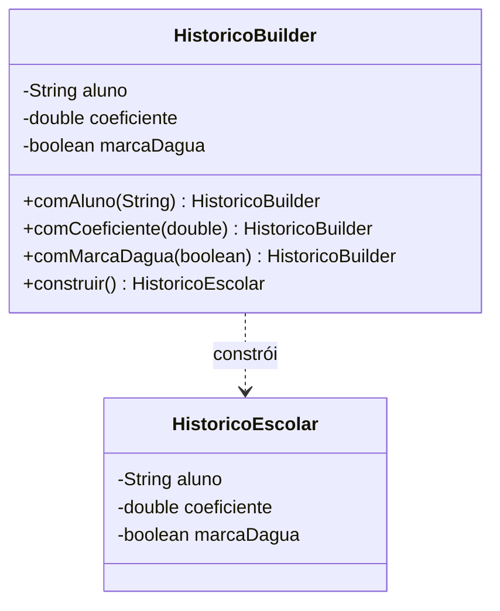

# Técnicas de Programação II — Aula 6

## Padrões Criacionais II: Abstract Factory, Builder, Singleton e Prototype

**Curso:** CST em Desenvolvimento de Software Multiplataforma — Fatec de Porto Ferreira
**Linguagem de apoio:** Java
**Versão:** Aluno

---

## 1. Propósito da aula

Na Aula 5, resolvemos o problema de criar **um** objeto sem acoplar o código à classe concreta, com a Simple Factory e o Factory Method. Agora ampliamos o repertório criacional para quatro situações que o Factory Method sozinho não cobre bem:

- E quando preciso criar **famílias inteiras** de objetos que combinam entre si? → **Abstract Factory**
- E quando o objeto é **complexo**, com muitas partes opcionais? → **Builder**
- E quando preciso garantir que exista **uma única instância** de algo? → **Singleton**
- E quando criar um objeto do zero é caro e seria melhor **clonar** um existente? → **Prototype**

Esta é uma aula densa: cobre os quatro padrões criacionais restantes do catálogo GoF. Trataremos **Abstract Factory e Builder com profundidade** — são os mais usados e conceitualmente mais ricos — e **Singleton e Prototype de forma mais objetiva**, por serem mais simples de entender.

---

## 2. Objetivos de aprendizagem

Ao final desta aula, você deverá ser capaz de:

- Aplicar o **Abstract Factory** para criar famílias de objetos relacionados;
- Aplicar o **Builder** para construir objetos complexos passo a passo;
- Explicar o **Singleton**, seu uso e suas críticas;
- Explicar o **Prototype** e a distinção entre cópia rasa e profunda;
- Escolher o padrão criacional adequado a cada situação.

---

## 3. Abstract Factory: famílias de objetos que combinam

### 3.1 O problema

O SIGA precisa acessar um banco de dados. Toda operação de acesso envolve três objetos que trabalham juntos: uma **conexão** com o banco, um **comando** que executa instruções e um **leitor** que percorre os resultados. O ponto crucial é que esses três objetos precisam ser **do mesmo fornecedor**: um comando feito para MySQL não funciona sobre uma conexão PostgreSQL. Eles formam uma **família** que só faz sentido junta.

Se o código criar esses objetos com `new` espalhado, nada impede a combinação errada — uma conexão de um fornecedor com um comando de outro. Pior: trocar o banco do sistema (uma decisão única e importante) exigiria caçar e alterar cada `new` espalhado pelo código.

### 3.2 A intenção

> **Intenção (GoF):** fornecer uma interface para criar famílias de objetos relacionados ou dependentes, sem especificar suas classes concretas.

O Abstract Factory eleva o conceito de fábrica: em vez de um método que cria um produto, temos uma **fábrica com vários métodos**, cada um criando um membro da família — e cada fábrica concreta garante que todos os seus produtos são do mesmo fornecedor e, portanto, combinam entre si.

### 3.3 Estrutura



### 3.4 Implementação

```java
// Interfaces dos produtos (membros da família)
public interface Conexao { void abrir(); }
public interface Comando { void executar(String sql); }

// A fábrica abstrata: um método por membro da família
public interface FabricaBanco {
    Conexao criarConexao();
    Comando criarComando();
}
```

```java
// Fábrica concreta do MySQL: só produz objetos MySQL
public class FabricaMySQL implements FabricaBanco {
    public Conexao criarConexao() { return new ConexaoMySQL(); }
    public Comando criarComando() { return new ComandoMySQL(); }
}

// Fábrica concreta do PostgreSQL: só produz objetos PostgreSQL
public class FabricaPostgreSQL implements FabricaBanco {
    public Conexao criarConexao() { return new ConexaoPostgreSQL(); }
    public Comando criarComando() { return new ComandoPostgreSQL(); }
}
```

```java
// O cliente recebe UMA fábrica e cria a família toda a partir dela
public class RepositorioAluno {
    private final Conexao conexao;
    private final Comando comando;

    public RepositorioAluno(FabricaBanco fabrica) {   // não sabe qual banco é
        this.conexao = fabrica.criarConexao();
        this.comando = fabrica.criarComando();
    }
}
```

> **Ideia-chave:** o cliente recebe **uma** fábrica e cria a família inteira a partir dela. Como a `FabricaMySQL` só produz objetos MySQL, é **impossível** combinar uma conexão MySQL com um comando PostgreSQL. E trocar o banco do sistema inteiro passa a ser uma decisão de **uma linha** — basta injetar outra fábrica. A coerência da família é garantida pela estrutura do código, não pela disciplina do programador.

### 3.5 Um segundo exemplo: exportação de relatório

O mesmo raciocínio aparece na exportação de relatórios do SIGA. Um relatório exportado tem três partes — **cabeçalho**, **corpo** e **rodapé** — que precisam estar todas no **mesmo formato**. Não faz sentido um cabeçalho em PDF com um corpo em texto puro: o arquivo final ficaria inconsistente.

Uma `FabricaRelatorioPDF` produz cabeçalho, corpo e rodapé em PDF; uma `FabricaRelatorioTexto` produz os três em texto puro. O cliente recebe uma das fábricas e monta o relatório inteiro num formato coerente, sem nunca misturar formatos:

```java
public interface FabricaRelatorio {
    Cabecalho criarCabecalho();
    Corpo criarCorpo();
    Rodape criarRodape();
}

// FabricaRelatorioPDF produz as três partes em PDF;
// FabricaRelatorioTexto produz as três partes em texto puro.
```

> **Destaque:** repare no padrão comum aos dois exemplos — banco de dados e relatório. Em ambos, há **vários objetos que precisam ser do mesmo "tipo"** (fornecedor, formato) e **não podem ser misturados**. Sempre que você identificar essa situação — "estes objetos só funcionam juntos se forem da mesma família" —, o Abstract Factory é a resposta.

### 3.6 Factory Method × Abstract Factory

| Aspecto | Factory Method | Abstract Factory |
|---|---|---|
| Cria | Um produto | Uma família de produtos |
| Estrutura | Um método de criação | Vários métodos, um por membro |
| Garante | Desacoplamento da criação | Coerência entre os produtos |
| Quando usar | Um tipo de objeto varia | Vários tipos variam juntos |

---

## 4. Builder: construir objetos complexos passo a passo

### 4.1 O problema

Considere criar um objeto `HistoricoEscolar`: ele tem nome do aluno (obrigatório), lista de disciplinas, coeficiente de rendimento, observações, marca d'água, e vários campos opcionais. Um construtor com todos esses parâmetros vira um monstro:

```java
// O "anti-padrão" do construtor telescópico
new HistoricoEscolar("Maria", disciplinas, 8.5, null, true, false, "obs", null);
// O que significa cada null, true, false? Impossível ler.
```

Esse é o problema do **construtor telescópico**: muitos parâmetros, muitos deles opcionais, ordem difícil de lembrar e chamadas ilegíveis.

### 4.2 A intenção

> **Intenção (GoF):** separar a construção de um objeto complexo de sua representação, de modo que o mesmo processo de construção possa criar diferentes representações.

O Builder oferece uma **construção passo a passo**, com métodos nomeados e encadeáveis, e só produz o objeto final quando chamamos `construir()`.

### 4.3 Estrutura



### 4.4 Implementação

```java
public class HistoricoEscolar {
    private final String aluno;
    private final double coeficiente;
    private final boolean marcaDagua;

    // Construtor privado: só o Builder cria
    private HistoricoEscolar(HistoricoBuilder b) {
        this.aluno = b.aluno;
        this.coeficiente = b.coeficiente;
        this.marcaDagua = b.marcaDagua;
    }

    public static class HistoricoBuilder {
        private String aluno;          // obrigatório
        private double coeficiente;    // opcionais têm valor padrão
        private boolean marcaDagua;

        public HistoricoBuilder(String aluno) {  // obrigatório vai no construtor
            this.aluno = aluno;
        }
        public HistoricoBuilder comCoeficiente(double c) {
            this.coeficiente = c;
            return this;               // retorna o próprio builder: encadeável
        }
        public HistoricoBuilder comMarcaDagua(boolean m) {
            this.marcaDagua = m;
            return this;
        }
        public HistoricoEscolar construir() {
            return new HistoricoEscolar(this);
        }
    }
}
```

```java
// Uso: legível, cada passo nomeado, opcionais só quando necessários
HistoricoEscolar h = new HistoricoEscolar.HistoricoBuilder("Maria")
        .comCoeficiente(8.5)
        .comMarcaDagua(true)
        .construir();
```

> **Ideia-chave:** o Builder troca um construtor gigante e ilegível por uma sequência de passos nomeados. O objeto só existe quando `construir()` é chamado — antes disso, o builder acumula as escolhas. O retorno `this` a cada passo é o que permite o encadeamento fluente.

---

## 5. Singleton: uma única instância

### 5.1 A intenção

> **Intenção (GoF):** garantir que uma classe tenha apenas uma instância e fornecer um ponto global de acesso a ela.

Alguns objetos devem existir **uma única vez** no sistema: um gerenciador de configurações, um pool de conexões, um registro de log. O Singleton garante isso.

### 5.2 Implementação

```java
public class Configuracao {
    // A única instância, criada uma vez
    private static final Configuracao INSTANCIA = new Configuracao();

    private Configuracao() { }   // construtor privado: ninguém cria de fora

    public static Configuracao getInstancia() {
        return INSTANCIA;
    }
}
```

Os três elementos essenciais: um **construtor privado** (impede `new` externo), um **atributo estático** que guarda a única instância, e um **método estático de acesso** (`getInstancia`).

### 5.3 As críticas ao Singleton

O Singleton é o padrão mais **controverso** do catálogo. Use-o com parcimônia, ciente de que ele:

- Introduz **estado global**, que dificulta rastrear quem alterou o quê;
- Prejudica a **testabilidade**, pois cria acoplamento oculto e dificulta substituir a instância por uma versão de teste;
- Exige cuidado extra em ambientes com **concorrência** (múltiplas threads).

> **Destaque:** saber implementar o Singleton é fácil; saber **quando não usá-lo** é a competência que se espera de você. Muitas vezes, injetar a dependência (como fizemos com o DIP) é preferível a um Singleton.

---

## 6. Prototype: criar por clonagem

### 6.1 A intenção

> **Intenção (GoF):** especificar os tipos de objetos a serem criados usando uma instância protótipo, e criar novos objetos pela cópia desse protótipo.

Quando criar um objeto do zero é caro (muita configuração, consulta a banco, cálculo pesado), pode ser mais eficiente **clonar** um objeto já configurado e ajustar o que difere.

### 6.2 Cópia rasa × cópia profunda

Este é o ponto de atenção do Prototype:

| Tipo de cópia | O que copia | Risco |
|---|---|---|
| **Rasa** (shallow) | Os campos primitivos e as **referências** dos objetos internos | O clone compartilha os objetos internos com o original |
| **Profunda** (deep) | Os campos primitivos e **cópias novas** dos objetos internos | Clone totalmente independente |

```java
public class ModeloProva implements Cloneable {
    private String titulo;
    private List<String> questoes;

    // Cópia profunda: duplica também a lista interna
    @Override
    public ModeloProva clone() {
        ModeloProva copia = new ModeloProva();
        copia.titulo = this.titulo;
        copia.questoes = new ArrayList<>(this.questoes);  // nova lista
        return copia;
    }
}
```

> **Ideia-chave:** numa cópia rasa, alterar a lista de questões do clone alteraria também a do original, porque ambos apontam para a **mesma** lista. A cópia profunda cria uma lista nova, tornando o clone independente. Escolher entre as duas depende de o objeto interno ser compartilhável ou não.

---

## 7. Escolhendo o padrão criacional

Os cinco padrões criacionais (contando o Factory Method da Aula 5) resolvem problemas distintos de criação:

| Padrão | Resolve |
|---|---|
| Factory Method | Criar um objeto sem acoplar à classe concreta |
| Abstract Factory | Criar famílias de objetos coerentes entre si |
| Builder | Construir um objeto complexo passo a passo |
| Singleton | Garantir uma única instância |
| Prototype | Criar por clonagem de um objeto existente |

> **Ideia-chave:** não existe padrão "melhor". Cada um responde a uma pergunta diferente sobre a criação. A competência é reconhecer **qual pergunta** o seu problema está fazendo.

---

## 8. Fundamentos que valem para qualquer linguagem

Todos esses padrões descrevem estruturas de criação independentes de linguagem:

- O **Builder** é tão útil em Java quanto em Python, C# ou Kotlin (que tem, inclusive, parâmetros nomeados que atenuam o problema do construtor telescópico);
- O **Singleton** existe em qualquer linguagem OO, e suas críticas (estado global, testabilidade) também são universais;
- O **Prototype** e a distinção rasa/profunda aparecem sempre que uma linguagem permite copiar objetos;
- O **Abstract Factory** é a base de muitos frameworks de interface gráfica multiplataforma, em qualquer stack.

---

## 9. Situação-problema

O SIGA precisa gerar documentos oficiais (histórico, declaração de matrícula, certificado) que existem em duas variações visuais coordenadas: uma para **impressão** (preto e branco, com marca d'água) e uma para **tela** (colorida, sem marca d'água). Cada variação tem seu cabeçalho, seu rodapé e seu estilo de tabela, que devem combinar entre si.

- Qual padrão criacional garante que os elementos de um documento pertençam todos à mesma variação?
- Se o documento em si tem muitas partes opcionais, qual padrão ajuda a construí-lo de forma legível?
- Se o gerador de documentos deve existir uma única vez no sistema, qual padrão se aplica?

Essa situação combina os padrões da aula e será a base da atividade prática.

---

## 10. Atividade prática

Consulte a ficha de atividade prática da aula. Em síntese, você irá:

| Etapa | Ação do estudante | Evidência esperada |
|---|---|---|
| 1 | Analisar o código inicial que mistura elementos de variações diferentes. | Diagnóstico do problema. |
| 2 | Implementar um Abstract Factory para as variações de documento (impressão e tela). | Fábricas concretas produzindo famílias coerentes. |
| 3 | Implementar um Builder para montar o documento com partes opcionais. | Construção passo a passo, legível. |
| 4 | Transformar o gerador de documentos em um Singleton. | Instância única com acesso controlado. |
| 5 | Desenhar o diagrama de classes da solução. | Diagrama UML consistente com o código. |

---

## 11. Questões de reflexão

1. Qual a diferença essencial entre Factory Method e Abstract Factory?
2. Que problema o Builder resolve que um construtor comum não resolve bem?
3. Por que o Singleton é considerado controverso, apesar de simples?
4. Qual a diferença entre cópia rasa e profunda no Prototype, e quando cada uma é adequada?
5. Diante de um problema de criação, como você decide qual padrão criacional aplicar?

---

## 12. Síntese final

Esta aula completou a família criacional do catálogo GoF. O **Abstract Factory** cria famílias de objetos coerentes, garantindo que os produtos combinem entre si. O **Builder** constrói objetos complexos passo a passo, substituindo construtores telescópicos ilegíveis. O **Singleton** garante instância única — útil, porém controverso pelo estado global e pelos problemas de testabilidade que introduz. O **Prototype** cria por clonagem, exigindo atenção à distinção entre cópia rasa e profunda.

Com o Factory Method da Aula 5, você agora conhece os cinco padrões criacionais e, mais importante, sabe reconhecer qual pergunta sobre criação cada um responde. Na próxima aula, deixamos a criação e passamos à **persistência de dados** com o padrão DAO — o objeto criado precisa, afinal, ser guardado em algum lugar.

---

## 13. Referências

FREEMAN, Eric; FREEMAN, Elisabeth. **Use a cabeça! Padrões de projetos**. 2. ed. Rio de Janeiro: Alta Books, 2007.

GAMMA, Erich; HELM, Richard; JOHNSON, Ralph; VLISSIDES, John. **Padrões de projeto: soluções reutilizáveis de software orientado a objetos**. Porto Alegre: Bookman, 2015.

BLOCH, Joshua. **Java efetivo**. 3. ed. Rio de Janeiro: Alta Books, 2019.

METSKER, Steven John; WAKE, William C. **Design patterns in Java**. Boston: Addison-Wesley, 2006.

SHVETS, Alexander. **Mergulho nos padrões de projeto**. Refactoring.Guru, 2021.
