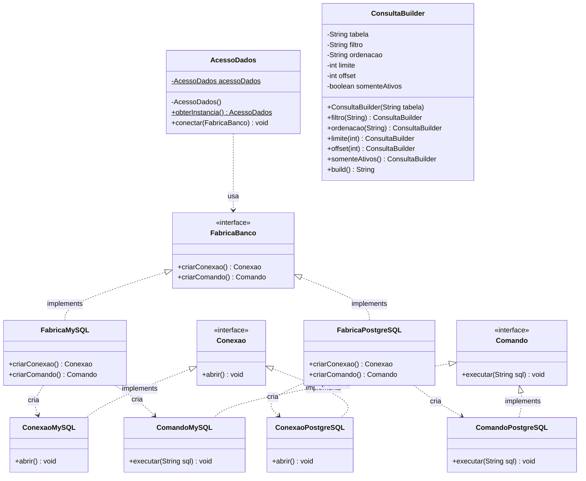

# Diagrama de Classes — SIGA Padrões Criacionais

```mermaid
classDiagram

    %% ── SINGLETON ──────────────────────────────────────────
    class AcessoDados {
        -AcessoDados acessoDados$
        -AcessoDados()
        +obterInstancia()$ AcessoDados
        +conectar(FabricaBanco) void
    }

    %% ── ABSTRACT FACTORY ───────────────────────────────────
    class FabricaBanco {
        <<interface>>
        +criarConexao() Conexao
        +criarComando() Comando
    }

    class FabricaMySQL {
        +criarConexao() Conexao
        +criarComando() Comando
    }

    class FabricaPostgreSQL {
        +criarConexao() Conexao
        +criarComando() Comando
    }

    class Conexao {
        <<interface>>
        +abrir() void
    }

    class Comando {
        <<interface>>
        +executar(String sql) void
    }

    class ConexaoMySQL {
        +abrir() void
    }

    class ConexaoPostgreSQL {
        +abrir() void
    }

    class ComandoMySQL {
        +executar(String sql) void
    }

    class ComandoPostgreSQL {
        +executar(String sql) void
    }

    %% ── BUILDER ────────────────────────────────────────────
    class ConsultaBuilder {
        -String tabela
        -String filtro
        -String ordenacao
        -int limite
        -int offset
        -boolean somenteAtivos
        +ConsultaBuilder(String tabela)
        +filtro(String) ConsultaBuilder
        +ordenacao(String) ConsultaBuilder
        +limite(int) ConsultaBuilder
        +offset(int) ConsultaBuilder
        +somenteAtivos() ConsultaBuilder
        +build() String
    }

    %% ── RELAÇÕES ───────────────────────────────────────────
    AcessoDados ..> FabricaBanco : usa

    FabricaBanco <|.. FabricaMySQL : implements
    FabricaBanco <|.. FabricaPostgreSQL : implements

    FabricaMySQL ..> ConexaoMySQL : cria
    FabricaMySQL ..> ComandoMySQL : cria
    FabricaPostgreSQL ..> ConexaoPostgreSQL : cria
    FabricaPostgreSQL ..> ComandoPostgreSQL : cria

    Conexao <|.. ConexaoMySQL : implements
    Conexao <|.. ConexaoPostgreSQL : implements
    Comando <|.. ComandoMySQL : implements
    Comando <|.. ComandoPostgreSQL : implements
```